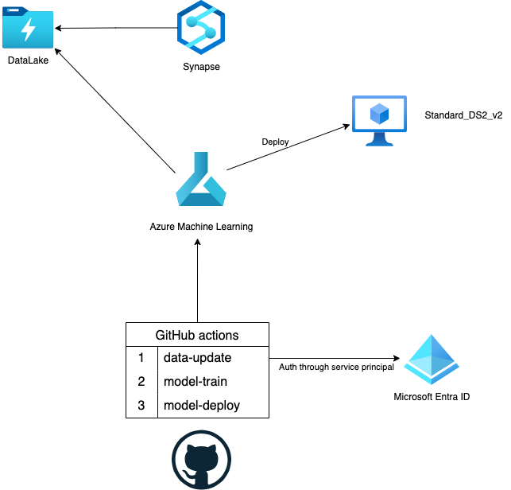
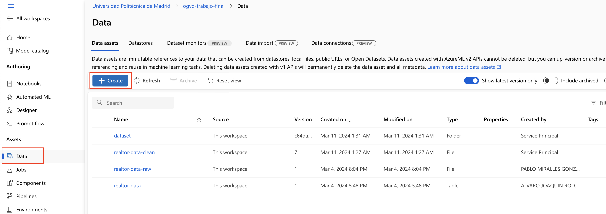
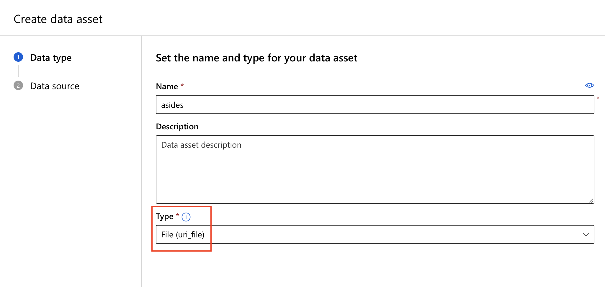
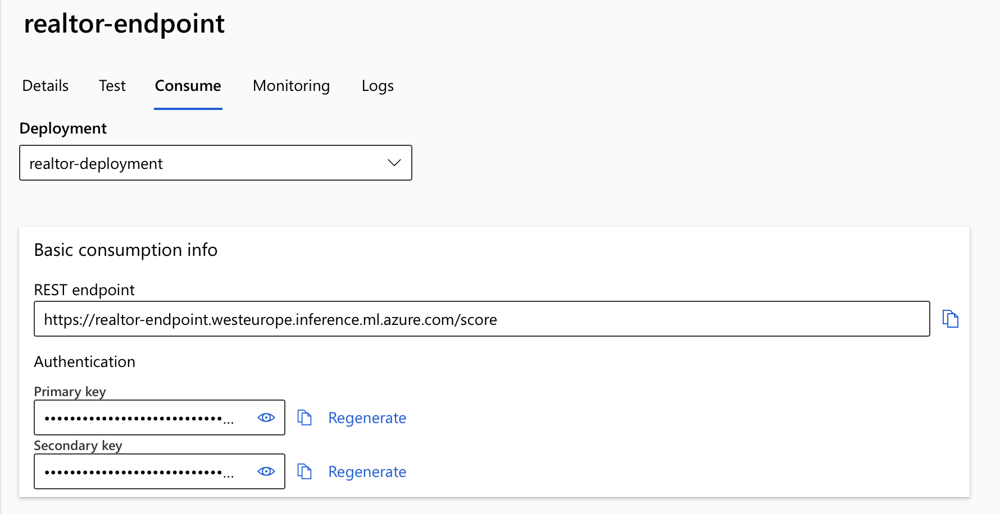

# OGVD - Assignment 2

## 🚀 Project architecture and description

The general architecture used is shown in the next figure. The use of Synapse and AzureML is orthogonal: the data processing decided during exploratory analysis is exported to a job performed in AzureML regularly through a script. The entire ML pipeline is triggered from GitHub Actions, authenticated through a Service Principal created from Microsoft Enter ID.



Regarding the Synapse part, we simply uploaded the notebook in `notebooks/eda.ipynb`, already executed from Synapse. In the AzureML part, we have three steps in the pipeline.

- **Date update**: This job retrieves the original dataset, cleans it, and saves it in a different one. In a real-world use case, the employed dataset would change between executions as new data arrives. The `data-update` directory implements both the YAML file that parameterizes the job and the code in a Python program. The action launching the data cleaning job from CLI is found in the `.github/workflows/data-update.yml` file.

- **Train model**: This job retrains the model with the cleaned data. Both the YAML file parameterizing the job and the code in a Python program are implemented in the `train-model` directory. The action launching the data cleaning job from CLI is found in the `.github/workflows/train-model.yml` file.

- **Deploy model**: This job creates an endpoint and deploys the trained model to that endpoint. In this case, the job is executed from the GitHub environment. It is defined in the `model-deploy/deploy.py` script and launched from `.github/workflows/model-deploy.yml`.

Additionally, the files `model-deploy/endpoint-create.yml` and `model-deploy/model-deploy.yml` are included in the code, which were the first implementation attempt. However, launching a job in Azure to deploy seems to have known issues with models registered by MLFLOW. In theory, these already integrate the model execution code, but the call by AzureCLI seems to require this code. We include these files as a reference for other use cases.

All these GitHub actions are executed when the previous step has finished executing. They also run when their respective repository directory has been modified through a Pull Request. Finally, the data update job, and therefore the entire pipeline, is launched once a week, which would serve to prevent possible data drift.


## 🐾 Reproduction details

### Part 1: Synapse for data analysis

A tutorial to create the data storage resource and the Synapse workspace can be found in [this link](https://github.com/MicrosoftLearning/DP-900T00A-Azure-Data-Fundamentals/blob/master/Instructions/Labs/dp900-04-synapse-lab.md). In that tutorial they also show how to ingest data from a CSV file, which is also our case ([link to our dataset](https://www.kaggle.com/datasets/ahmedshahriarsakib/usa-real-estate-dataset)).

After this, one can download the notebook `notebooks/eda.ipynb` and upload it to the Synapse workspace, and run it adjusting the path to the dataset in their workspace.

### Part 2: MLOps pipeline

#### Step 2.1. Create a Machine Learning workspace

The first section in [this link](https://learn.microsoft.com/es-es/azure/machine-learning/quickstart-create-resources?view=azureml-api-2) describes how to create an AzureML workspace.

#### Step 2.2. Create the raw dataset

1. Go to the data tab in your AzureML workspace and click on the **Create** button.
    
2. Select type *uri_file*.
    
3. Upload the CSV data file.

#### Step 2.3. Link your Azure subscription and ML Workspace to GitHub
1. **Create service principal**: This is explained in ["Set up authentication for Azure Machine Learning resources and workflows"](https://github.com/MicrosoftLearning/DP-900T00A-Azure-Data-Fundamentals/blob/master/Instructions/Labs/dp900-04-synapse-lab.md). This tutorial explain how to generate a JSON certificate that allows you to authenticate from GitHub. Using Azure CLI, and after loging in, you must run: ```az ad sp create-for-rbac --json-auth --name ml-auth --role Contributor --scopes /subscriptions/<subscription id>```. This command generates the JSON file:
    ```json
    {
        "clientId": "your-client-id",
        "clientSecret": "your-client-secret",
        "subscriptionId": "your-sub-id",
        "tenantId": "your-tenant-id",
        "activeDirectoryEndpointUrl": "https://login.microsoftonline.com",
        "resourceManagerEndpointUrl": "https://management.azure.com",
        "activeDirectoryGraphResourceId": "https://graph.windows.net",
        "sqlManagementEndpointUrl": "https://management.core.windows.net:5555",
        "galleryEndpointUrl": "https://gallery.azure.com/",
        "managementEndpointUrl": "https://management.core.windows.net"
    }
    ```   
2. **Create secret in GitHub**: You must create a secret named ```ÀZURE_CREDENTIALS``` containing JSON. You can add a secret from *Settings* > *Secrets and variables* > *Actions* > *New repository secret*.
3. **Create variables in GitHub**: Additionally, you must create the variables ```RESOURCE_GROUP``` and ```WORKSPACE_NAME``` to choose in which environment the tasks will be executed. This can be done by choosing *Variables* in the same place as above.

#### Step 2.4. Run the pipeline through GitHub actions
Manual run the **data-update** GitHub Action to start the full pipeline. You can uncomment the cron schedule in the `.github/workflows/data-update.yml` file to make it recurrent, and you can adjust the schedule. After each step is finished, the next one should start.

#### Step 2.5. Run the model through the endpoint
After the deployment is finished, go to the **Endpoint** tab in the left sidebar. Select the created endpoint and go to the consume tab as in the following picture.


Using the key as Bearer token, you can access the endpoint. Underneath you will find code examples, or you can run it in Postman.

## 🎥 Demos

We show a small demonstration of the deployed endpoint working in [this link](https://upm365-my.sharepoint.com/:v:/g/personal/pablo_miralles_upm_es/Eaa-pSD08spHj1fR6mhGJo8BKNdJYsK4mCYNXNh1HcD9oQ?nav=eyJyZWZlcnJhbEluZm8iOnsicmVmZXJyYWxBcHAiOiJPbmVEcml2ZUZvckJ1c2luZXNzIiwicmVmZXJyYWxBcHBQbGF0Zm9ybSI6IldlYiIsInJlZmVycmFsTW9kZSI6InZpZXciLCJyZWZlcnJhbFZpZXciOiJNeUZpbGVzTGlua0NvcHkifX0&e=NJPN45), to show that everything works without spending resources.
